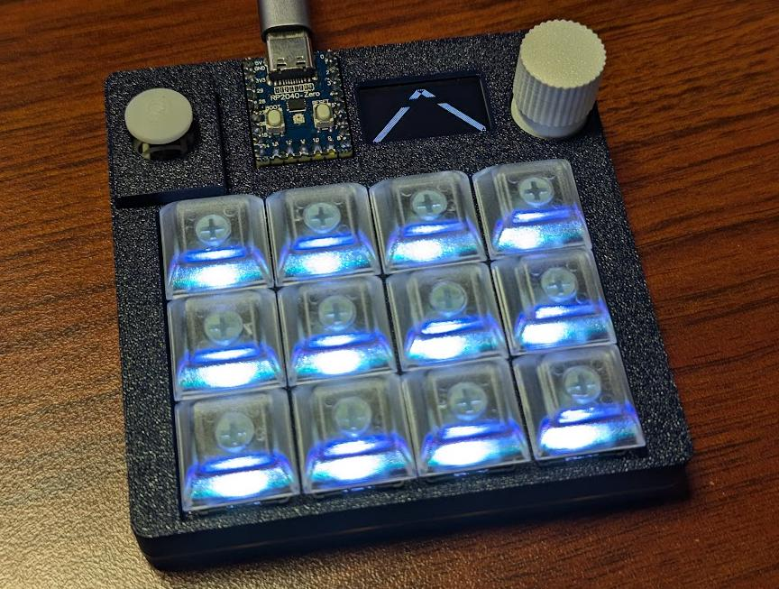
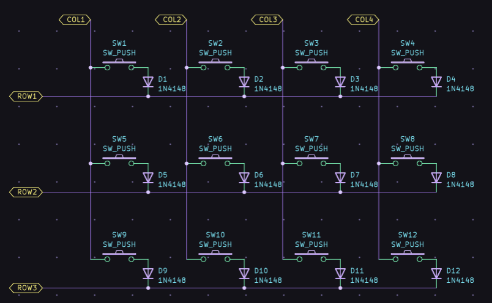

# tinygo-keeb/workshop



このページは 2024/08/04 からスタートした TinyGo Keeb Tour 用の記事です。
不明点はこのリポジトリの Issue や [twitter:sago35tk](https://x.com/sago35tk) で質問いただければサポートします。

ハードウェアの組み立ては以下を参照してください。

* [ビルドガイド](./buildguide.md)
* [build guide (english)](./buildguide_EN.md)

このページへ QR コードはこちら。  


# 環境設定

## TinyGo のインストール

以下のインストールが必要です。
TinyGo については、このページの記入時点の最新版である v0.32.0 の URL を記載しましたが、適宜最新バージョンを使用してください。

* Git
    * https://git-scm.com/downloads
    * Go / TinyGo には不要ですがこのハンズオン実施に対して必要です
* Go
    * https://go.dev/dl/
        * install の詳細 : https://go.dev/doc/install
* TinyGo
    * https://github.com/tinygo-org/tinygo/releases/latest
        * install の詳細 : https://tinygo.org/getting-started/install/

ただし Go と TinyGo で Version の組み合わせがあるので注意が必要です。
TinyGo は基本的に最新および直前 Version の Go と組み合わせて使う必要があります。

| TinyGo | 対応する Go |
| ------ | ----------- |
| 0.32.0 | 1.19 - 1.22 |
| 0.33.0 | 1.23 - 1.22 |

それぞれの実行体に PATH が通っていれば使うことができます。
少し Version が古いですが以下も参考になると思います。

* [TinyGo のインストール](https://qiita.com/sago35/items/92b22e8cbbf99d0cd3ef#tinygo-%E3%81%AE%E3%82%A4%E3%83%B3%E3%82%B9%E3%83%88%E3%83%BC%E3%83%AB)

インストールできたかの確認は以下で実施することができます。

```
$ tinygo version
tinygo version 0.33.0 windows/amd64 (using go version go1.22.5 and LLVM version 18.1.2)

$ tinygo build -o out.uf2 --target waveshare-rp2040-zero --size short examples/serial
   code    data     bss |   flash     ram
   7836     108    3152 |    7944    3260
```

### Windows + WSL2

WSL2 上の Ubuntu などには linux 版の TinyGo を使うことができます。
しかし WSL2 から Windows ホスト上の USB につながっているものを直接見ることはできないため苦労が付きまといます。
WSL2 を使う場合においても、基本的には Windows 版の TinyGo を Windows のパスにインストールするほうが良いです。
この場合、 Go も Windows 版をインストールしておく必要があります。

どうしても WSL2 上の TinyGo からやり取りしたい場合は以下のように usbipd を使う手もあります。
しかし tinygo flash をするたびに usbipd の attach が必要となるためあまり快適ではない気がします。

* [WSL2にインストールしたtinygoでtinygo monitorをraspberry pi picoで実行](https://qiita.com/kn12abc/items/d6bfc172cf08d9be6e1a)

### Linux での設定

Linux で `tinygo flash` や `tinygo monitor` や `Vial` を使うには udev rules の設定が必要です。
以下の内容で `/etc/udev/rules.d/99-zero-kb02-udev.rules` を作成し再起動してください。

```
# RP2040
# ref: https://docs.platformio.org/en/latest/core/installation/udev-rules.html
ATTRS{idVendor}=="2e8a", ATTRS{idProduct}=="[01]*", MODE:="0666", ENV{ID_MM_DEVICE_IGNORE}="1", ENV{ID_MM_PORT_IGNORE}="1"

# Vial
# ref: https://get.vial.today/manual/linux-udev.html
KERNEL=="hidraw*", SUBSYSTEM=="hidraw", ATTRS{serial}=="*vial:f64c2b3c*", MODE="0660", GROUP="users", TAG+="uaccess", TAG+="udev-acl"
```

上記と同じ内容のファイルが以下にあります。

* [./99-zero-kb02-udev.rules](./99-zero-kb02-udev.rules)

上記ファイルは以下のドキュメントから作成しています。
詳細等を確認する場合は適宜参照してください。

* https://docs.platformio.org/en/latest/core/installation/udev-rules.html
* https://get.vial.today/manual/linux-udev.html

### TinyGo の dev branch 版

開発中の最新 Version を使いたい場合、 GitHub Actions でビルドされた Artifact > release-double-zipped をダウンロードしてください。

* windows
    * https://github.com/tinygo-org/tinygo/actions/workflows/windows.yml?query=branch%3Adev
* linux
    * https://github.com/tinygo-org/tinygo/actions/workflows/linux.yml?query=branch%3Adev
* macos
    * https://github.com/tinygo-org/tinygo/actions/workflows/build-macos.yml?query=branch%3Adev

詳細は以下を参照してください。

* [TinyGo の開発版のビルド方法と、ビルドせずに開発版バイナリを手に入れる方法](https://qiita.com/sago35/items/33e63ca5073f572ad69c#pr-%E5%86%85%E3%81%A7%E4%BD%9C%E6%88%90%E3%81%95%E3%82%8C%E3%81%9F%E3%83%90%E3%82%A4%E3%83%8A%E3%83%AA%E3%82%92%E4%BD%BF%E3%81%86)

## LSP / gopls 対応

TinyGo は、 machine package などを GOROOT に配置しているため設定を行うまでは gopls 等でエラーが表示され machine.LED の定義元へのジャンプ等が出来ません。
TinyGo は machine package など (Go を良く知っていても) 慣れていない package 構成であったり、 build-tag による分岐などが多いため TinyGo 用の LSP の設定をしておいた方が無難です。

公式ドキュメントは以下にあります。

* https://tinygo.org/docs/guides/ide-integration/

VSCode の場合は TinyGo という拡張をインストールすると良いです。
Vim (+ vim-lsp) の場合は `github.com/sago35/tinygo.vim` を使ってみてください。

日本語の情報としては以下に記載しています。

* [TinyGo + 'VSCode or Vim (もしくはそれ以外の LSP 対応エディタ)' で gopls 連携する方法](https://qiita.com/sago35/items/c30cbce4a0a3e12d899c)
* [TinyGo + Vim で gopls するための設定](https://qiita.com/sago35/items/f0b058ed5c32b6446834)

# 開発対象

TinyGo Keeb Tour では zero-kb02 という自作キーボード／マクロパッドを使用します。
マイコンは RP2040 (Cortex M0+) で、マイコンボードは [Waveshare RP2040-Zero](https://www.waveshare.com/rp2040-zero.htm) を使用しています。


主な機能は以下の通りです。

* Waveshare RP2040-Zero
    * https://www.waveshare.com/rp2040-zero.htm
    * https://www.waveshare.com/wiki/RP2040-Zero
* RGB LED 付きの 12 キー
* マウスカーソルの移動などに使用できる 2 軸アナログジョイスティック
* ロータリーエンコーダー
* 有機 EL ディスプレイ (OLED) - 128x64 単色
* [GROVE コネクター](https://lab.seeed.co.jp/entry/2019/10/25/120432)
* 背面 2x6 ピンソケット

回路図、ファームウェア、ピン配置等は以下から確認することができます。

* https://github.com/sago35/keyboards
    * 回路図 : [kicanvas](https://kicanvas.org/?github=https%3A%2F%2Fgithub.com%2Fsago35%2Fkeyboards%2Ftree%2Fmain%2Fzero-kb02%2Fzero-kb02)

## 組み立て

はんだ付け等の手順はビルドガイドにて。

* [ビルドガイド](./buildguide.md)
* [build guide (english)](./buildguide_EN.md)


# TinyGo の基本

最初にこのリポジトリをどこかに git clone しておいてください。
以降、このリポジトリのルートからコマンドを実行していきます。
ソースコードを変更してみる場合は、ローカルのコードを修正してください。

```
$ git clone https://github.com/tinygo-keeb/workshop

$ cd workshop

# VS Code などを立ち上げる
$ code .
```

ソースコードは `./00_basic` や `./12_matrix_basic` などのパスにあります。

## ビルド＋書き込み方法

TinyGo ではコマンドラインからビルド＋書き込みを行うことができますが、ここでは手動での書き込み方法を学びます。
RP2040 搭載のボードは BOOT / BOOTSEL と呼ばれているボタンを押しながらリセット (リセットボタンを押す、 USB に接続する、等) をすることでブートローダーに遷移することができます。
ブートローダーに遷移すると PC からは外付けドライブとして認識するので、あとは書き込みたいバイナリファイル (`*.uf2`) を D&D などでコピーすることで書き込みできます。

ここでは以下を書き込みしてみてください。

* [00_basic.uf2](https://github.com/tinygo-keeb/workshop/releases/download/0.1.0/00_basic.uf2)

キースイッチ部の LED が光っていたら書き込み成功です。

※この書き込み方法は TinyGo 以外で作られた uf2 ファイルに対しても有効です

上記の 00_basic.uf2 を自分で作成する場合は以下のコマンドを実行します。
エラーメッセージ等が表示されず、 `00_basic.uf2` ができていれば成功です。

```
$ tinygo build -o 00_basic.uf2 --target waveshare-rp2040-zero --size short ./00_basic/
   code    data     bss |   flash     ram
  20420     192    3240 |   20612    3432
```

## ビルド＋書き込み方法 (その2) + シリアルモニター

tinygo flash コマンドを用いてビルドと書き込みを一度に実施することもできます。
エラーメッセージ等が表示されなければ正常に書き込みが完了しています。
Linux 環境で失敗する場合は、前述の udev rules の設定を確認してください。

```
$ tinygo flash --target waveshare-rp2040-zero --size short examples/serial
   code    data     bss |   flash     ram
   7836     108    3152 |    7944    3260
```

上記で書き込んだ `examples/serial` はシリアル出力に `hello world!` と表示する例です。
以下で動作を確認することができます。

```
$ tinygo monitor
Connected to COM7. Press Ctrl-C to exit.
hello world!
hello world!
hello world!
```

うまく接続できない場合は port を調べて --port オプションを追加してください。
waveshare-rp2040-zero は、 RP2040 マイコンを使うほかのボードと共通の USB VID/PID を使っているので Boards のところが正しく表示されないケースがありますが気にしないでください。

```
$ tinygo ports
Port                 ID        Boards
COM7                 2E8A:0003 waveshare-rp2040-zero

$ tinygo monitor --port COM7
Connected to COM7. Press Ctrl-C to exit.
hello world!
hello world!
hello world!
```

`tinygo flash` と `tinygo monitor` を一つにまとめた `tinygo flash --monitor` という実行方法もあります。
が、環境によっては接続先ポートを誤ったりするケースがあるため、うまく動かない場合は上記のように別で実行してください。

```
$ tinygo flash --target waveshare-rp2040-zero --size short --monitor examples/serial
   code    data     bss |   flash     ram
   7836     108    3152 |    7944    3260
Connected to COM7. Press Ctrl-C to exit.
hello world!
hello world!
hello world!
```

### macOS 15 Sequoia で tinygo flash 出来ない場合

`$TINYGOROOT/targets/rp2040.json` の `msd-volume-name` に `NO NAME` を追加してください。  
$TINYGOROOT は `tinygo env` で調べることができます。  

変更後の JSON ファイルは以下です。  

```json
{
    "inherits": ["cortex-m0plus"],
    "build-tags": ["rp2040", "rp"],
    "flash-1200-bps-reset": "true",
    "flash-method": "msd",
    "serial": "usb",
    "msd-volume-name": ["RPI-RP2", "NO NAME"],
    "msd-firmware-name": "firmware.uf2",
    "binary-format": "uf2",
    "uf2-family-id": "0xe48bff56",
    "rp2040-boot-patch": true,
    "extra-files": [
        "src/device/rp/rp2040.s"
    ],
    "linkerscript": "targets/rp2040.ld",
    "openocd-interface": "picoprobe",
    "openocd-transport": "swd",
    "openocd-target": "rp2040"
}
```

* https://github.com/tinygo-org/tinygo/issues/4519

### macOS で 「ディスクの不正な取り出し」 の通知がたまっていくのを何とかしたい

ターミナルを開いて以下を実行して再起動すると、通知が出なくなるようです。

```
$ sudo defaults write /Library/Preferences/SystemConfiguration/com.apple.DiskArbitration.diskarbitrationd.plist DADisableEjectNotification -bool YES && sudo pkill diskarbitrationd
```

元に戻したい場合は以下を実行して再起動してください。

```
$ sudo defaults delete /Library/Preferences/SystemConfiguration/com.apple.DiskArbitration.diskarbitrationd.plist DADisableEjectNotification && sudo pkill diskarbitrationd
```

See: https://www.reddit.com/r/mac/comments/vsn1t6/how_to_disable_not_ejected_safely_notification_on/


## L チカ

以下を実行してください。

```shell
$ tinygo flash --target waveshare-rp2040-zero --size short ./01_blinky1/
```

無事に RP2040 Zero の RGB LED が光ることが確認出来たらソースコードを変更して色や点滅速度を変えてみましょう。
以下の black や white のところに `color.Color` を設定することができます。

```go
// 01_blinky1/main.go
for {
    time.Sleep(time.Millisecond * 500)
    ws.PutColor(black)
    time.Sleep(time.Millisecond * 500)
    ws.PutColor(white)
}
```

その他の色の例は以下になります。
RGBA を指定して任意の色を設定することができます。
0xFF を小さい値にすることで光り方を (ある程度) 弱めることができます。

```
red     = color.RGBA{R: 0xFF, G: 0x00, B: 0x00, A: 0x00}
green   = color.RGBA{R: 0x00, G: 0xFF, B: 0x00, A: 0x00}
blue    = color.RGBA{R: 0x00, G: 0x00, B: 0xFF, A: 0x00}
yellow  = color.RGBA{R: 0xFF, G: 0xFF, B: 0x00, A: 0x00}
cyan    = color.RGBA{R: 0x00, G: 0xFF, B: 0xFF, A: 0x00}
magenta = color.RGBA{R: 0xFF, G: 0x00, B: 0xFF, A: 0x00}
```

## L チカ (その2)

キーを光らせてみましょう。
基板には WS2812B 互換の SK2812MINI-E が 12 個搭載されています。
以下の位置／順番で搭載されています。

```
 0  3  6  9
 1  4  7 10
 2  5  8 11
```

以下を実行してください。
無事に動いたらソースコードを変更して色や点滅速度や点滅パターンを変えてみましょう。

```shell
$ tinygo flash --target waveshare-rp2040-zero --size short ./02_blinky2/
```

先ほどとほとんど同じですが、 `PutColor()` の代わりに `WriteRaw()` が使われています。
ここで `colors[0][:i+1]` という指定をしていますが、 `[:1]` という指定の場合は最初の LED のみ設定して終了となります。
`[:4]` だと合計 4 個の LED を変更します。

```go
// ./02_blinky2/main.go
ws.WriteRaw(colors[0][:i+1])
```

`WriteRaw()` は uint32 で色を指定することができます。
最上位から 8 bit ずつ Green / Red / Blue という形で値を設定します。
例えば以下のようになります。

```go
// ./02_blinky2/main.go
colors := []uint32{
    0xFFFFFFFF, // white
    0xFF0000FF, // green
    0x00FF00FF, // red
    0x0000FFFF, // blue
}
```

0xFF を小さい値にすることで光り方を (ある程度) 弱めることができます。

## USB CDCで Hello World

Printf デバッグなどにも使えるし何かと使いどころのある USB CDC も実行しておきましょう。
USB CDC は Universal Serial Bus Communications Device Class の略で、雑な説明としてはパソコンとマイコン間で通信を行うためのものです。
説明するよりも実際に試したほうが分かりやすいので、まずは以下を実行してみてください。

```shell
$ tinygo flash --target waveshare-rp2040-zero --size short examples/serial

$ tinygo monitor
```

Windows で実行すると以下のようになります。

```
$ tinygo flash --target waveshare-rp2040-zero --size short examples/serial
   code    data     bss |   flash     ram
   7836     108    3152 |    7944    3260

$ tinygo monitor
Connected to COM7. Press Ctrl-C to exit.
hello world!
hello world!
hello world!
(以下省略)
```

examples/serial は以下のようなソース ([./03_usbcdc-serial](./03_usbcdc-serial)) です。
`hello world!` を表示してから 1 秒待つ、を繰り返しています。
こちらも待ち時間や、表示文字列の変更、あるいは fmt.Printf() を使った書き込み、などに変えてみてください。

```shell
$ tinygo flash --target waveshare-rp2040-zero --size short ./03_usbcdc-serial/
```

標準入力は以下のようなソース ([./04_usbcdc-echo/](./04_usbcdc-echo/)) で扱うことができます。
改行は `Enter` / `Return` キーを押した後 `Ctrl-j` を押す必要があります。

```go
// ./04_usbcdc-echo/main.go
package main

import (
	"bufio"
	"fmt"
	"os"
)

func main() {
	scanner := bufio.NewScanner(os.Stdin)
	for scanner.Scan() {
		fmt.Printf("you typed : %s\n", scanner.Text())
	}
}
```

## ロータリーエンコーダー

tinygo-org/drivers にある encoders/quadrature を使うことができます。

* https://github.com/tinygo-org/drivers/blob/release/examples/encoders/quadrature-interrupt/main.go

zero-kb02 用に設定を合わせたものは以下の通りです。

```
// ./05_rotary/main.go
enc := encoders.NewQuadratureViaInterrupt(
    machine.GPIO3,
    machine.GPIO4,
)
enc.Configure(encoders.QuadratureConfig{
    Precision: 4,
})
```

以下のコマンドで書き込み、動作確認が可能です。
ロータリーエンコーダーを動かすと value の表示が更新されます。
LED と連動させてみたりすると面白いでしょう。

```
$ tinygo flash --target waveshare-rp2040-zero --size short ./05_rotary/
   code    data     bss |   flash     ram
   8276     108    3624 |    8384    3732

$ tinygo monitor
Connected to COM7. Press Ctrl-C to exit.
value:  -1
value:  -2
value:  -1
value:  0
value:  1
value:  2
(以下省略)
```

なおロータリーエンコーダーは押下するとボタンとして扱うことができます。
ロータリーエンコーダーの押下状態の取得については後述します。

## ロータリーエンコーダーの押下状態を取得する

ロータリーエンコーダーを押下すると GND と接続されて Low になります。
(プルアップしておけば) 押下していない状態では High になります。

基本的には以下のようなコードになります。

```go
// ./13_rotary_button/main.go
if !btn.Get() {
    println("pressed")
} else {
    println("released")
}
```

```shell
$ tinygo flash --target waveshare-rp2040-zero --size short ./13_rotary_button/

$ tinygo monitor
```

ロータリーエンコーダーを押すと、`tinygo monitor` を実行中の terminal に `pressed` が出力されます。

## アナログジョイスティック

アナログジョイスティックは押し込みでデジタル値として、 XY の二軸に対してはアナログ値として認識されます。
なので以下のように扱うことができます。

```shell
$ tinygo flash --target waveshare-rp2040-zero --size short ./06_joystick/
   code    data     bss |   flash     ram
  56792    1536    3176 |   58328    4712

$ tinygo monitor
Connected to COM7. Press Ctrl-C to exit.
7440 8000 false
7130 7F90 true
(以下省略)
```

左から X 軸値 (電圧を表す値)、 Y 軸値、押し込んだかどうか、を表します。
何もしていないときは 0x8000 に近い値が表示されます。

## OLED

tinygo-org/drivers にある ssd1306/i2c_128x64 を使うことができます。

* https://github.com/tinygo-org/drivers/tree/release/examples/ssd1306/i2c_128x64/main.go

zero-kb02 用に設定を合わせたものは以下の通りです。

```go
// ./07_oled/main.go
machine.I2C0.Configure(machine.I2CConfig{
    Frequency: machine.TWI_FREQ_400KHZ,
    SDA:       machine.GPIO12,
    SCL:       machine.GPIO13,
})
display := ssd1306.NewI2C(machine.I2C0)
display.Configure(ssd1306.Config{
    Address: 0x3C,
    Width:   128,
    Height:  64,
})
```

以下のコマンドで書き込み、動作確認が可能です。

```go
$ tinygo flash --target waveshare-rp2040-zero --size short ./07_oled/
```

※2024/08/04 時点で時々 OLED 描画が止まってしまうことがあります (現在調査中

### 図形を描画する

```shell
$ tinygo flash --target waveshare-rp2040-zero --size short ./08_oled_tinydraw/
```

### 文字列を描画する

```shell
$ tinygo flash --target waveshare-rp2040-zero --size short ./09_oled_tinyfont/
```

### 画面を回転する

zero-kb02 では OLED を上下逆に取り付けているので何らかの方法で画面を回転させる必要があります。
ここではハードウェアにより反転させてみます。

下記のように Config の Rotation で回転させることができます。
SSD1306 の場合は `Rotation0` (回転無し) と `Rotation180` (反転) のみ使用できます。

```go
// ./10_oled_rotated/main.go
display.Configure(ssd1306.Config{
    Address:  0x3C,
    Width:    128,
    Height:   64,
    Rotation: drivers.Rotation180,
})
```

Configure() 時以外でも `SetRotation()` により回転させることができます。

```go
display.SetRotation(drivers.Rotation180)
```

```shell
$ tinygo flash --target waveshare-rp2040-zero --size short ./16_oled_inverted_hw/
```

### 画面を 90 度回転する

ハードウェアにより回転無しもしくは反転を実施できました。
しかし、場合によっては 90 度回転させてディスプレイを縦長で使いたいケースがあります。
この場合はソフトウェアにより回転させる必要があります。
画面描画は原則として以下の Displayer interface に対応しているので、画面を回転できる Displayer を定義します。

```go
// https://github.com/tinygo-org/drivers/blob/release/displayer.go
type Displayer interface {
    // Size returns the current size of the display.
    Size() (x, y int16)

    // SetPizel modifies the internal buffer.
    SetPixel(x, y int16, c color.RGBA)

    // Display sends the buffer (if any) to the screen.
    Display() error
}
```

ここでは以下を定義しました。
struct に Displayer を埋め込み Size および SetPixel の x および y の値を加工しています。

```go
// ./16_oled_inverted_hw/main.go
type RotatedDisplay struct {
	drivers.Displayer
}

func (d *RotatedDisplay) Size() (x, y int16) {
	return y, x
}

func (d *RotatedDisplay) SetPixel(x, y int16, c color.RGBA) {
	_, sy := d.Displayer.Size()
	d.Displayer.SetPixel(y, sy-x, c)
}
```

```shell
$ tinygo flash --target waveshare-rp2040-zero --size short ./10_oled_rotated/
```

### アニメーションさせる

`display.ClearBuffer()` と `display.Display()` を用いることでちらつきなく画面を書き換えることができます。

```shell
$ tinygo flash --target waveshare-rp2040-zero --size short ./11_oled_animation/
```

### 日本語を表示する

現在 BDF と OTF/TTF フォントのいずれかが表示できます。  
zero-kb02 のような 1bit color の小型ディスプレイだと BDF フォントが適しています。  
以下にて使用することができます。  

```shell
$ tinygo flash --target waveshare-rp2040-zero --size short ./17_oled_japanese_font/
```

## キー押下状態を取得する

zero-kb02 は matrix と呼ばれる配線方法を使ってキーが接続されています。
下記の回路の通り 12 個のスイッチを COL:4 x ROW:3 の 7 ピンで取得する形です。



どのように読み取るか、というと以下のようになります。

1. COL1 のみ High にして、それ以外の COL2 ～ COL4 を Low にする
2. 少し待つ
3. その状態で ROW1 ～ ROW3 を読み取る
    * ROW1 が High になっているなら SW1 が押されている
    * ROW2 が High になっているなら SW5 が押されている
    * ROW3 が High になっているなら SW9 が押されている

次に COL2 のみ High にすれば SW2 / SW6 / SW10 を読み取り可能、となります。

matrix 配線は自作キーボードで広く使われている接続方式なので、一度実装してみましょう。
上記を素朴に実装すると以下のようになります。


```go
// ./12_matrix_basic/main.go
colPins[0].High()
colPins[1].Low()
colPins[2].Low()
colPins[3].Low()
time.Sleep(1 * time.Millisecond)

if rowPins[0].Get() {
    fmt.Printf("sw1 pressed\n")
}
if rowPins[1].Get() {
    fmt.Printf("sw5 pressed\n")
}
if rowPins[2].Get() {
    fmt.Printf("sw9 pressed\n")
}
```

同じように実装していくことですべてのキーの押下状態を取得できます。

```shell
$ tinygo flash --target waveshare-rp2040-zero --size short --monitor ./12_matrix_basic/
```

ループを整理したり、キー数を可変にしたりすることで、キーボードファームウェアに近づいていきます。

※ matrix 配線を詳しく知りたい方は以下をご覧ください
https://blog.ikejima.org/make/keyboard/2019/12/14/keyboard-circuit.html

## Pin 入力を使った USB HID Keyboard

ロータリーエンコーダーの押下状態を使って USB HID Keyboard を作ってみましょう。
以下のコードにより押下状態と `A` キーを連動させることができます。
TinyGo では `machine/usb/hid/keyboard` を import して `keyboard.Port()` をコールするとキーボードとして認識させることができます。


```go
// ./14_hid_keyboard/main.go
kb := keyboard.Port()
for {
    if !btn.Get() {
        kb.Down(keyboard.KeyA)
    } else {
        kb.Up(keyboard.KeyA)
    }
}
```

```shell
$ tinygo flash --target waveshare-rp2040-zero --size short ./14_hid_keyboard/
```

ロータリーエンコーダーを押して動作を確認しましょう。

## Pin 入力を使った USB HID Mouse

ロータリーエンコーダーの押下状態を使って今度は USB HID Mouse を作ってみましょう。
以下のコードによりボタンの押下がマウスの左クリックになります。

```go
// ./15_hid_mouse/main.go
m := mouse.Port()
for {
    if !btn.Get() {
        m.Press(mouse.Left)
    } else {
        m.Release(mouse.Left)
    }
}
```

```shell
$ tinygo flash --target waveshare-rp2040-zero --size short ./15_hid_mouse/
```

ロータリーエンコーダーを押して動作を確認しましょう。

## MIDI を使ってみる

TinyGo は USB MIDI に対応しているので、 MIDI 音源にしたり、 MIDI 楽器にすることができます。  
12 個のキーおよびロータリーエンコーダーの押し込みを使用することができます。  

```
$ tinygo flash --target waveshare-rp2040-zero --size short ./18_midi/
```

作成後は例えば以下のようなサイトで試すことができます。  

* https://midi.city/

Windows 環境では MIDI-OX を使うとよいでしょう。  

* http://www.midiox.com/

# sago35/tinygo-keyboard を使う

自作キーボードに必要な要素、というのは人によって違うと思います。
しかしその中でも

* レイヤー機能
* ビルドしなおすことなく設定変更できる
* 各種スイッチ読み取り方法が package になっている

というあたりが必要なことが多いです。
そのあたりを毎回自前で作成するのは大変なので、何らかのライブラリなどを使うことが多いと思います。
ここでは、拙作の sago35/tinygo-keyboard を使って自作キーボードを作っていきましょう。

sago35/tinygo-keyboard を使うと以下のような機能を簡単に導入することができます。

* 様々な方式のキー入力 (matrix や GPIO やロータリーエンコーダーなど) に対応
    * 自分で拡張を書くことも可能
* レイヤー機能
* マウスクリック、ポインタ移動との統合
* TRRS ケーブルによる分割キーボードサポート
* Vial による Web ブラウザ経由での書き換え
    * キーマップ
    * レイヤー
    * matrix tester (キースイッチの押下テスト)
    * マクロ機能

特に Vial での書き換えが重要であり、これにより各自の好みの設定に変更しやすいです。
Vial は以下にあり、 WebHID API に対応した Edge / Chrome などからアクセスすることで設定変更が可能です。

* https://vial.rocks/

## 基本的な使い方

使い方の詳細については以下に記載しました。

* [sago35/tinygo-keyboard を用いて自作キーボードを作ろう](https://qiita.com/sago35/items/b008ed03cd403742e7aa)
* [Create Your Own Keyboard with sago35/tinygo-keyboard](https://dev.to/sago35/create-your-own-keyboard-with-sago35tinygo-keyboard-4gbj)


## zero-kb02 の firmware

以下にあります。

* https://github.com/sago35/keyboards


## トラブルシュート

- プログラムの書き込みが出来ない

`tinygo ports` コマンドでマイコンが認識されているか確認してください。正常に認識されていれば、`waveshare-rp2040-zero` が出力されます。

```
$ tinygo ports
Port                 ID        Boards
COM7                 2E8A:0003 waveshare-rp2040-zero
```

認識されていない場合は、マイコンをPCから外して挿し直してください。

## 作例

* https://x.com/ysaito8015/status/1827626098450166185
* https://x.com/ysaito8015/status/1827630059580231788
* https://x.com/sago35tk/status/1830208709471223966
* https://x.com/Ryu_07_29/status/1847921967070163377
* [./19_redkey/](./19_redkey/)

# その他 Tips など

* 写真や動画を撮るときは 30 フレーム / 秒とかにしておくと液晶がちらつかない

# お知らせ

TinyGo 0.26 + Wio Terminal という組み合わせで技術書「基礎から学ぶ TinyGoの組込み開発」 (2022/11/12 発売) を執筆しました。本ページと合わせて確認してみてください。

* https://sago35.hatenablog.com/entry/2022/11/04/230919
