# Build guide

## parts list

| No | Item name                            | Quantity | Notes |
|----|---------------------------------|------|------|
| 1  | PCB                            | 1    | [info](https://github.com/sago35/keyboards?tab=readme-ov-file#zero-kb02)
| 2  | Grove connector                 | 1    |
| 3  | Diode                      | 12   | 1N4148
| 4  | Joystick                | 1    | [RKJXV122400R (Alps Alpine)](https://akizukidenshi.com/catalog/g/g115951/)
| 5  | Pin socket (1x8)              | 2   |
| 6  | Pin socket (1x7)              | 1    |
| 7  | OLED display                       | 1    | SSD1306 128x64
| 8  | Pull-up resistor                  | 2    | 3.3K (1K - 10K)
| 9  | L-shaped pin socket (2x6)             | 1    |
| 10 | Key switch                    | 12   |
| 11 | Key cap                    | 12   |
| 12 | Key socket                        | 1    | MX socket
| 13 | RP2040 Zero                     | 1    |
| 14 | Rotary encoder          | 1    |
| 15 | RGB LED                     | 12   | SK6812MINI-E
| 16 | ruber foot                          | 1    |
| 17 | USB-C cable            | 1    | 
| 18 | Flathead screw 2.1x10                 | 4    | 2x10 also works
| 19 | Case                         | 1    | [stl](https://github.com/sago35/keyboards/tree/main/zero-kb02/stl)
| 20 | Rotary encoder knob     | 1    | [stl](https://github.com/sago35/keyboards/tree/main/zero-kb02/stl)
| 21 | Large rotary encoder knob | 1    | [stl](https://github.com/sago35/keyboards/tree/main/zero-kb02/stl)
| 22 | Joystick hat            | 1    | [stl](https://github.com/sago35/keyboards/tree/main/zero-kb02/stl)

## Component descriptions

### PCB

On the left of the image is the top part of the PCB and on the right is the bottom side.

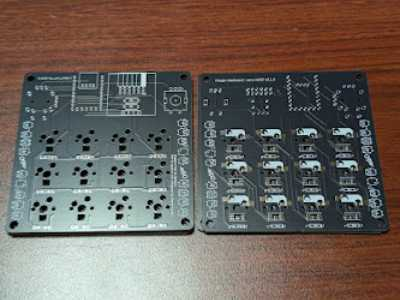

### Grove connector

It's a 2mm pitch 4-pin connector with the pin configuration being SCL / SDA / 3.3V / GND.
Be careful as SCL/SDA signals (I²C) are shared with the OLED display.

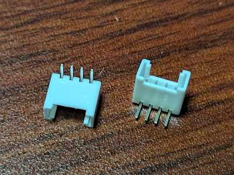

There are many expansion boards available for Grove.
The ones that can be used with zero-kb02 are limited to those that can be used with 3.3V I2C.

* https://www.switch-science.com/search?type=article%2Cpage%2Cproduct&q=Grove*
* https://www.switch-science.com/search?type=article%2Cpage%2Cproduct&q=Grove*+I2C* ← Filtered by I2C 

### Diode

Diodes have polarity, so make sure to connect them in the correct direction. They won’t work if connected backward.  

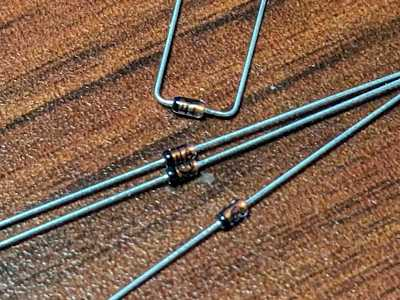

You can bend it neatly by using the given bender as in the image below.

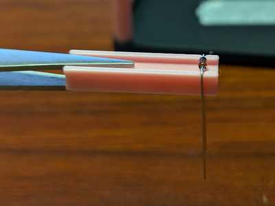

### Joystick

An analog joystick that detects both tilt and push. It’s an Alps Alpine product, with over 80% market share in the home gaming console sector.
  

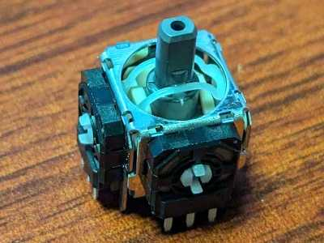

### Pin sockets (1x8)

A pin socket so that the microcontroller can be inserted and removed.

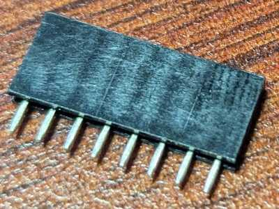

### Pin socket (1x7)

A pin socket so that the microcontroller can be inserted and removed.

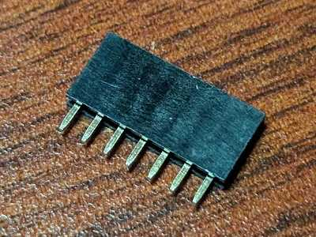

### OLED display

I2C monochrome OLED display. The resolution is 128x64 and the controller is SSD1306.

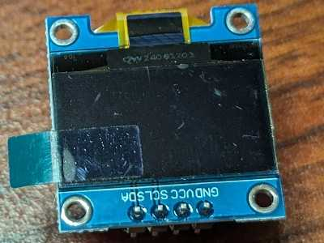

### Pull-up resistor

A 3.3kΩ resistor for I2C lines.

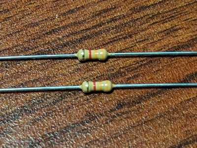

### L-shaped pin socket (2x6)

An L-shaped pin socket to be placed under the OLED.
It has two rows, top and bottom.

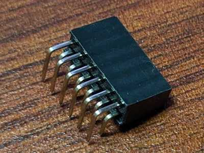

### Key switch

When pressed, the two terminals on the back are connected.
Many brands and models are available to choose from (Kailh, Otemu, Gateron, Cherry,...).

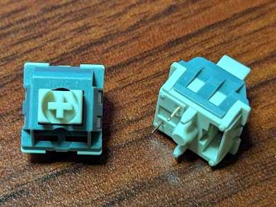

### Key cap

Used by placing it over the key switch.
Many options are available in different materials, shapes, and colors.

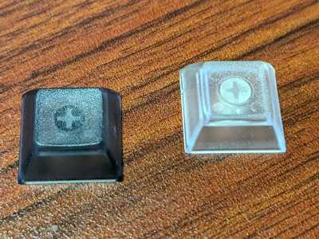

### Key socket

A socket that allows you to insert and remove key switches without soldering. The socket itself needs to be soldered.

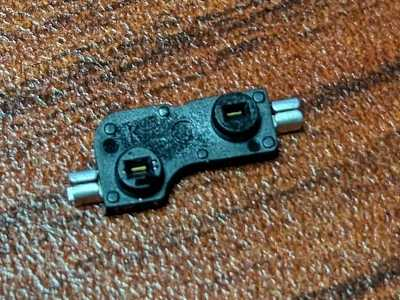

### RP2040 Zero

A microcomputer board equipped with a microcomputer called RP2040.

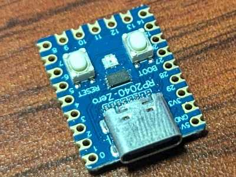

### Rotary encoder

Can detect rotation and depression.
Used for volume controls, mouse wheels, etc. 

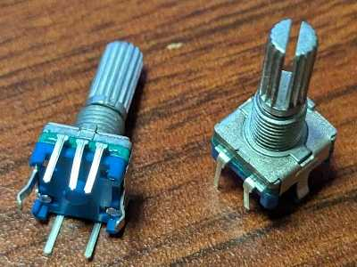

### RGB LED (SK6812MINI-E)

Full color RGB LED.
Soldered to the board in inverted position.

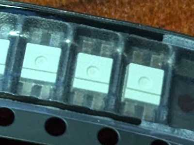

The correct orientation of the LEDs is to match the notch on one of its legs to the corner of the solkscreen.

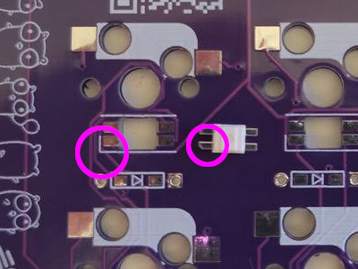

### Rubber feet

Stick them on the bottom of the case to prevent slipping.

### USB-C cable

For communication with a computer.
Depending on the environment, it may be C to C or A to C.  

### Flathead screw 2.1x10

Used for both the final case and the _workbench_ mode

### Case

This is the case.

### Rotary encoder knob

This is the knob for the rotary encoder.

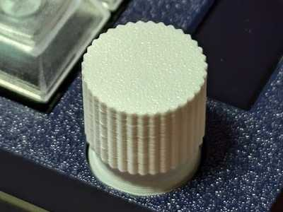

### Large rotary encoder knob

This is another knob for the rotary encoder.
Use this when you need to keep turning it with your fingers.

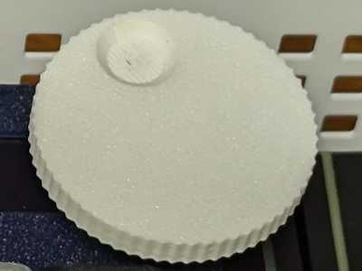

### Joystick knob

This is a knob for the joystick.

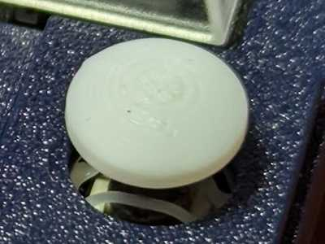

# Soldering/assembly

The following describes soldering and assembly.
For each item, some work on the front side and some work on the back side.
The badge below indicates the orientation at the start of work, so please refer to it. 

* 
* 

## Assembling the work bench

Assemble the work bench to make soldering smoother.
If you have the person next to you hold the bottom plate, assembly will go more smoothly, so please work together.

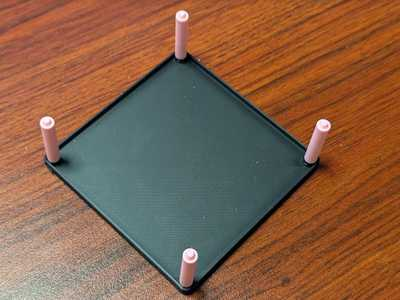

Screw the `solder supports` to the bottom part of the case. Perform the action on a flat and stable surface like a table. This is the `workbench mode`.

##  insert the diodes x 12

Use the `diode bender` to bend the diodes and insert them into the back of PCB.

Please pay attention to the orientation of the diodes as they have polarity and will not work if inserted the wrong way.
As shown in the photo on the right, match the direction of the silk-printed triangular mark with the direction of the black side of the diode (arrow). 

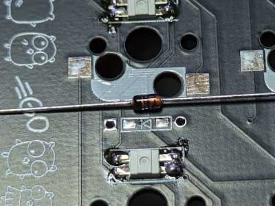
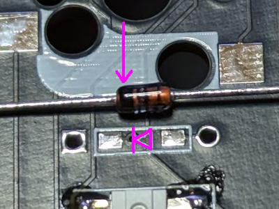

Solder one side.
If the position is significantly off, heat it again to melt the solder and adjust the position.

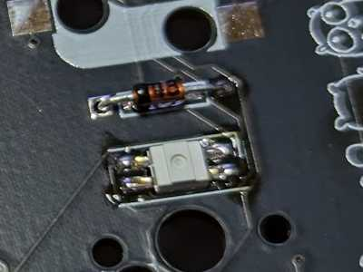

Complete once both sides are soldered.

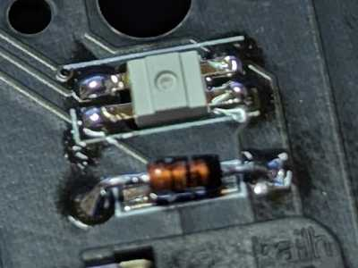

Once all soldering is done, turn it over and cut the legs with pliers or similar.

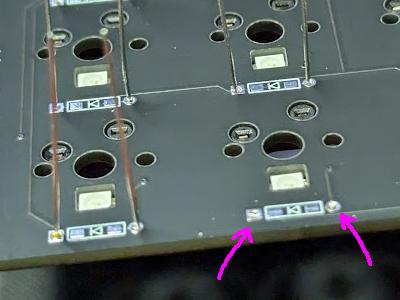

##  Resistor x 2

Solder one side.
Resistors have no orientation.
If the position is significantly off, heat it again to melt the solder and adjust the position.

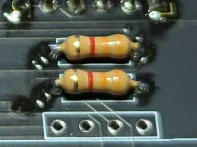

Complete once both sides are soldered.
Once all soldering is done, turn it over and cut the legs with pliers or similar.

##  Pin sockets

Place the pin sockets (1x8 x 2 + 1x7 x 1) on the board.

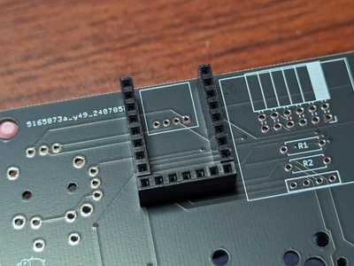

Insert the pin header that comes with the RP2040 Zero.
As shown in the picture, the longer pin will be on the bottom, and insert the longer one into the socket.
This will allow you to achieve a vertical alignment.

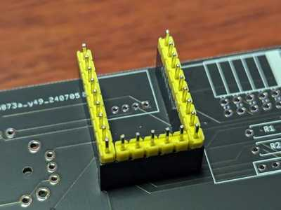

Place the RP2040 Zero and solder only one pin.
Once soldered, check the position/orientation, and melt the solder to adjust it if necessary.
Make sure it is inserted firmly and deeply.

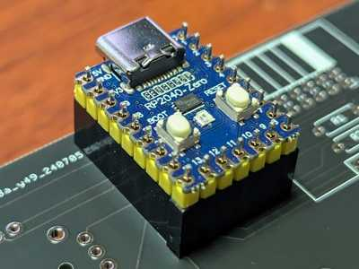

Once all the pins have been soldered, remove them from the socket.

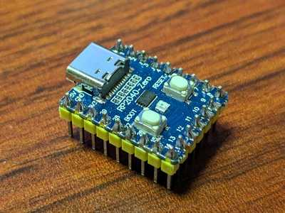

##  RGB LED (SK6812MINI-E)

(Omitted as already installed)

##  Key switch socket

Place the socket along the silk.  

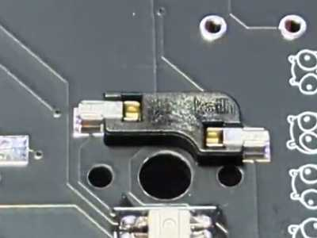

First, solder one side.
Firmly heat the land (board side) and then melt the solder.
Once the solder has melted, press the socket down with your finger while wearing the gauntlet.
Soldering must be completed when the socket is firmly attached to the board.
Once soldering is complete, check the position/direction, and melt the solder to adjust it if necessary.

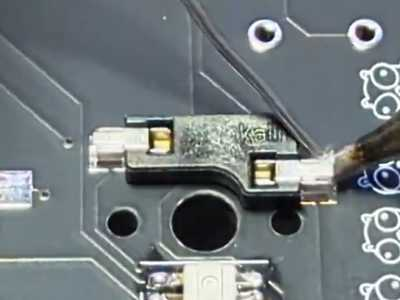
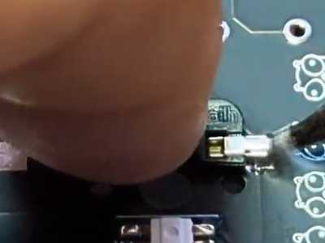

Next, solder the other side. 

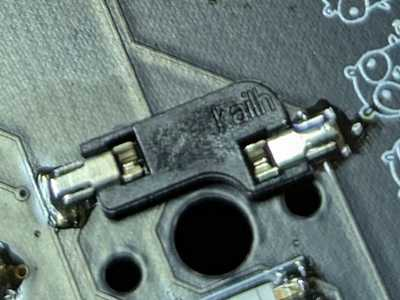

##  Joystick

Once you place the joystick, solder the part indicated by the arrow.
Once soldering is complete, check that it is firmly attached, and if not, melt the solder and adjust the position.

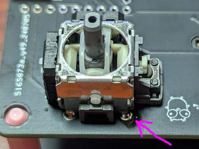

Solder another pin.

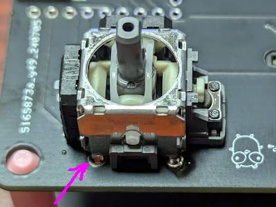

##  Joystick

Turn it over and solder all the parts.
You can omit soldering the four points indicated by the arrows (you can also solder them).
 

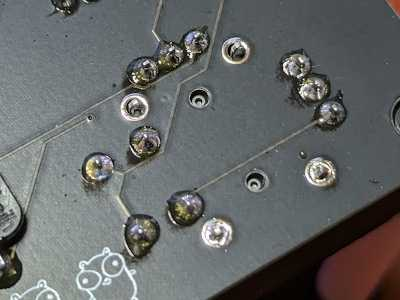

##  Grove connector

Solder only the pin indicated by the arrows.
After soldering, check the position/direction, and if necessary, melt the solder to adjust it.

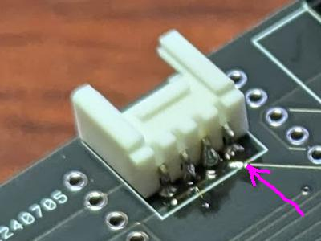

Next, stop the pin indicated by the arrow so that there are two pins remaining.
After soldering, check the position/direction, and if necessary, melt the solder to adjust it. 

Solder the remaining pins.

##  L-shaped pin socket 2x6

Same as the Grove connector, solder only one pin.
After soldering, check the position/orientation, and melt the solder to adjust it if necessary.

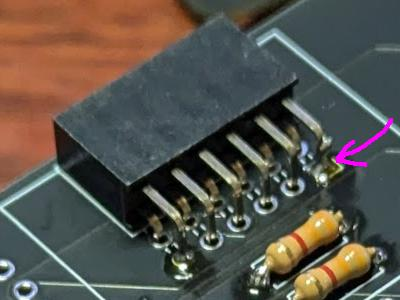

Next, stop the pin with the arrow so that two pins are fixed.
After soldering, check the position/orientation, and melt the solder to adjust it if necessary.

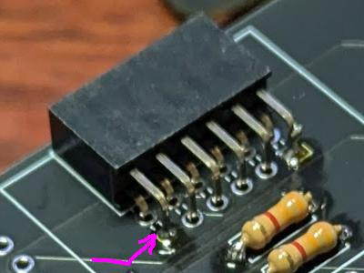

Solder the remaining pins from the back side.

##  Rotary encoder

It can be inserted from either the front or back, so be careful of the orientation.
Insert it into the board from the front side.
In this case, it is easier to remove it from the workbench and insert it.
Pay attention to the direction you insert it (the rotating part should be on the same side as the joystick).
Check from the back to make sure it is inserted properly.

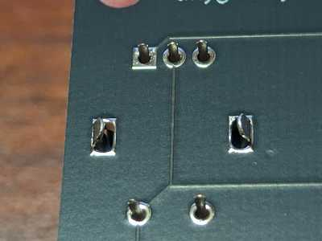

Just like the Grove connector, solder only one pin.
After soldering, check the position/orientation, and melt the solder to adjust it if necessary.

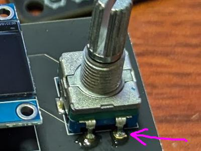

Solder the second pin.
After soldering, check the position/orientation, and melt the solder to adjust it if necessary.

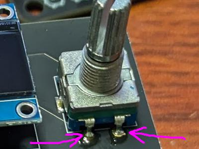

Solder the remaining pins.

##  Microcontroller socket

Insert the socket (1x8 x 2 + 1x7 x 1) and place the microcontroller (this will make it vertical).
If necessary, secure it with masking tape, etc.
You can also have the person next to you hold it down from the back and solder it. Please cooperate and proceed as needed.

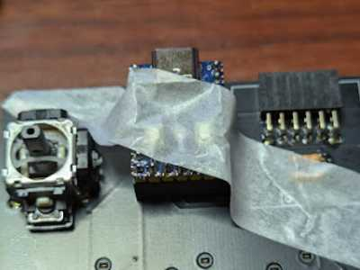

Solder from the back in the order ① → ② → ③.
Check that each pin is properly inserted, and melt the solder and adjust the position as necessary.

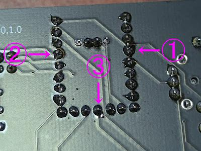

Solder the remaining pins.

##   LCD display

Lightly insert the LCD display into the board (don't insert it all the way, just insert it a little).

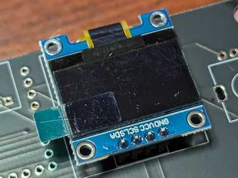

Take it off the workbench and remove the protective film.
The protective film is not removed in the photo, but please remove it at this point.
Attach the case.
Adjust the LCD position if it is clearly not in the right position.
Push the case in until it fits firmly into the board (you cannot do this while it is still on the workbench).

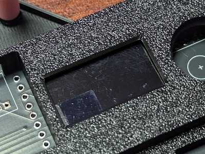

Flip it over and solder it.
Here too, attach only one pin, turn it over and check, and repeat this process.
Check that each pin is inserted properly, and melt the solder if necessary to adjust the position.

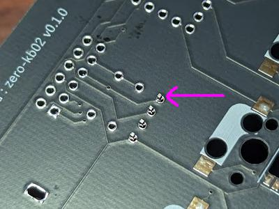

Complete when all 4 pins are soldered.

# Assembly from here

## Key switch

Insert it so that it sticks in.

Since it is hot swappable, it is easy to check by inserting it while Vial's matrix tester is running.

A common mistake is that the legs do not stick in properly.

Remove it once, straighten the legs, and try again.

## Key cap

Insert it so that it sticks in.

There is actually a direction (vertical and horizontal), but you don't need to worry about that.

## Joystick knob, rotary encoder knob

Insert it straight from above.

Be careful not to touch the LCD display when removing it.

## Microcomputer

Insert it so that it sticks in.

When removing it, loosen it little by little with tweezers or something similar. 

## Screws

Be careful not to overtighten it.
It is best to have very little force required to turn the screws.
If there is a gap between the board and the case, adjust it by hand, rather than tightening the screws.

# Check everything is working

Download the following firmware (`*.uf2`) and check.

## How to flash the firmware

1. Connect the microcontroller and PC with a USB-C cable. 
2. Open Explorer and check that it is recognized as USB mass storage (it should appear as `RPI-RP2`). 
3. Drag and drop the downloaded firmware into the USB mass storage.

Turn the rotary encoder and check that the RGB LED lights up and the volume changes.
Press other keys as appropriate and check that the LED lights up.

* https://github.com/sago35/keyboards/releases/download/0.3.0/zero-kb02.uf2

You can also check with Vial's matrix tester.
You can also check key bindings from Vial.

* https://vial.rocks/

# Other

The following was used to create the badges:

https://michaelcurrin.github.io/badge-generator/